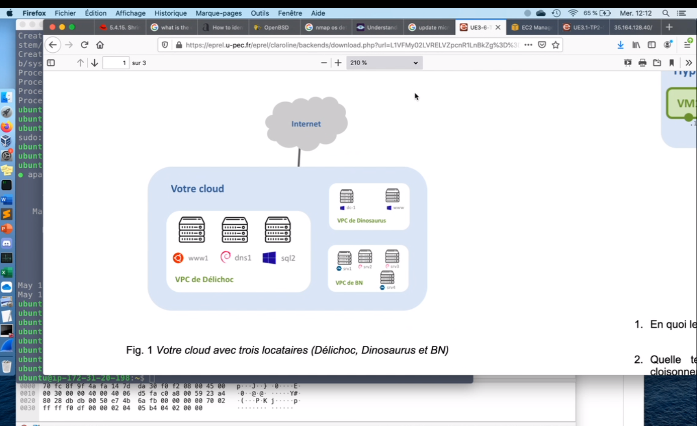
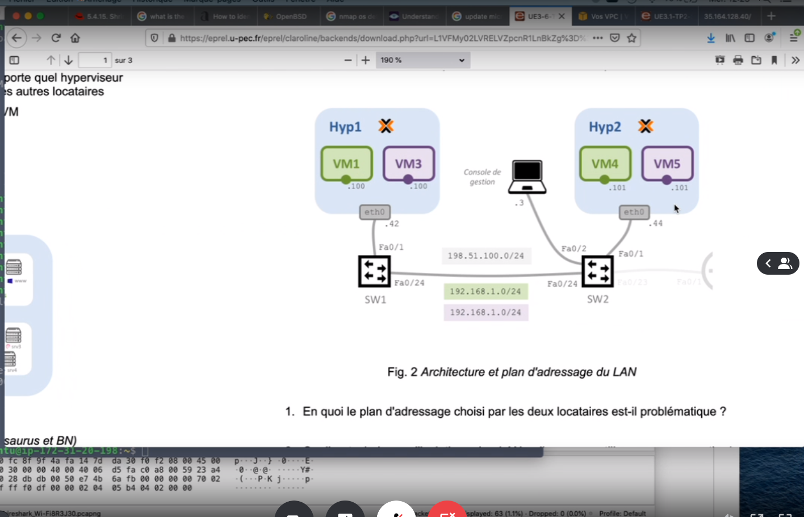

prérequis TP U31 ADMINS SYST SSH

TP UE36 

Demande de crédits de 20$ 

AWS Cloud Computing

EC2 -- IAAS Infra As A Service

Créer des machines virtuelles dans différents datacenter

us-west-2 Oregon USA par défaut
datacenter historique d'amazon à Orgeon *le premier qui a été créé*

eu-west-3 Paris

Instance = VM en gros

AMI :
- Instances : 
    - WINDOWS server
    - Linux :
        - Ubuntu
        - Suse
        - Fedora
    - Macos

- Type d'instances :
    - t2.micro gratuit et 10 cts/H
    - t2.2xlarge extralarge
    - c4.8xlarge

- Avec SSH :
    - clé publique - clé privée *au lieu du mdp*
        - La créé sur Amazon via puttygen et via créer une nouvelle paire de clé - télécharger une paire de clé (la clé privée)
        - Définir les permissions
            <!-- - `chmod 600 $path/demo_ssh.ssh` -->
            - `chmod g-r $path/demo_ssh.ssh` `&&` `chmod o-r $path/demo_ssh.ssh`
        - Authentification avec la clé en paramètres
            - `ssh -i $path/demo_ssh.ssh ubuntu@$IP_pub_aws`

- SYN ACK Firewall paquet test d'installation de paquets

- Tenant (locataire)
    - Schemas : 
        - 
        <!-- - :::image type="complex" source="images/Capture_decran 2021-05-19121310.png" alt-text="schema1_TP":::
        :::image-end::: -->

- VPC Virtual Private Cloud : Peuvent êtres étanches entre eux : via l'IPSec
    - CHANEL ne veut pas que ces VM soit partagés à DIOR car il y a de la confidentialité
        - routage intervlan
        
    - TP avec que des VPC étanches pas d'inter-connexion entre les autres

- isolation : maquette :
    
    
    - routeurs va effectuer du NAT statique : atrribuer une @IP statique privée avec une autre IP publique

- TP avec Proxmox et TD en vu

<!-- -  -->

> [!NOTE]
> Copyright Brice-Augustin, Amine AA